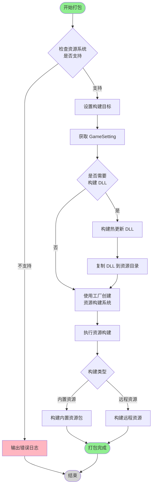
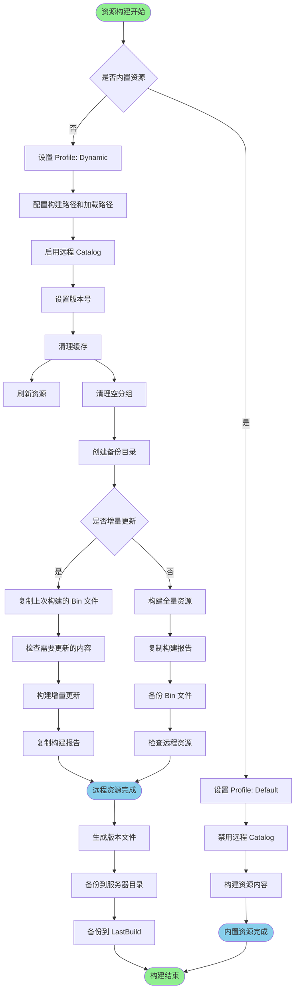
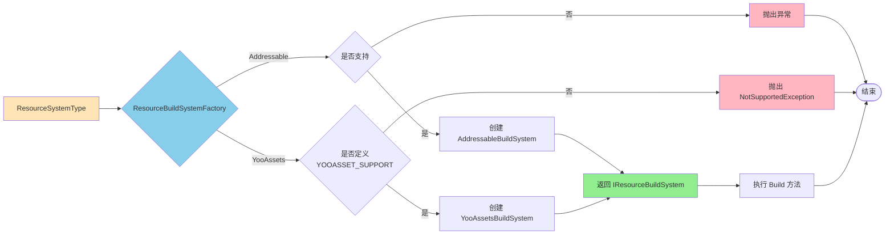

# LFramework 打包系统文档

## 📋 目录

- [架构概述](#架构概述)
- [打包流程图](#打包流程图)
- [核心组件](#核心组件)
- [打包流程详解](#打包流程详解)
- [配置说明](#配置说明)
- [使用指南](#使用指南)
- [扩展开发](#扩展开发)

---

## 架构概述

LFramework 打包系统采用**策略模式 + 工厂模式**设计，支持多种资源管理系统（Addressable、YooAssets）。

### 核心设计理念

- **接口分离**：通过 `IResourceBuildSystem` 接口抽象资源构建逻辑
- **工厂创建**：使用 `ResourceBuildSystemFactory` 根据配置创建构建系统
- **辅助工具**：`AddressableBuildHelper` 提供通用辅助方法
- **易于扩展**：可轻松添加新的资源系统支持

### 目录结构

```
BuildPackage/
├── Builder/
│   ├── BuildingResource/
│   │   ├── BuildResourcesData.cs          # 公共 API 入口
│   │   ├── BuildResourcesWindow.cs        # 打包窗口
│   │   ├── BuildDllsHelper.cs             # DLL 构建辅助
│   │   └── ResourceSystem/                # 资源系统实现
│   │       ├── Interface/
│   │       │   ├── IResourceBuildSystem.cs      # 资源构建系统接口
│   │       │   └── ResourceSystemType.cs        # 资源系统类型枚举
│   │       ├── Addressable/
│   │       │   ├── AddressableBuildSystem.cs    # Addressable 实现
│   │       │   └── AddressableBuildHelper.cs    # Addressable 辅助工具
│   │       ├── YooAssets/
│   │       │   └── YooAssetsBuildSystem.cs      # YooAssets 实现
│   │       └── ResourceBuildSystemFactory.cs    # 工厂类
│   └── Builders/                          # 平台构建器
│       ├── Android/
│       ├── iOS/
│       └── Standalone/
└── Pipeline/                              # 构建管线（可选）
    ├── Interface/
    ├── Core/
    ├── Tasks/
    └── Pipelines/
```

---

## 打包流程图

### 整体流程



### 资源构建详细流程



### 工厂模式流程



---

## 核心组件

### 1. BuildResourcesData

**职责**：公共 API 入口，数据容器

**主要方法**：
- `Build(BuildResourcesData data)` - 静态方法，打包入口
- `SetBuildTarget(BuildTarget target)` - 设置构建目标平台

**关键字段**：
```csharp
public ResourceSystemType ResourceSystem;      // 资源系统类型
public BuilderTarget BuilderTarget;            // 构建目标平台
public string AppVersion;                      // 应用版本
public string ResourcesVersion;                // 资源版本
public bool IsResourcesBuildIn;                // 是否内置资源
public bool IsBuildDll;                        // 是否构建 DLL
public BuildType BuildType;                    // 构建类型（APP/资源更新）
```

### 2. IResourceBuildSystem

**职责**：资源构建系统接口

**接口定义**：
```csharp
public interface IResourceBuildSystem
{
    void Build(BuildResourcesData data, AddressableAssetSettings settings, GameSetting gameSetting);
    void BuildInPackage(AddressableAssetSettings settings);
    string GetBuildPath(BuildResourcesData data);
    string GetLoadPath(BuildResourcesData data);
}
```

### 3. ResourceBuildSystemFactory

**职责**：根据资源系统类型创建构建系统实例

**主要方法**：
- `Create(ResourceSystemType type)` - 创建构建系统
- `IsSupported(ResourceSystemType type)` - 检查是否支持
- `GetDisplayName(ResourceSystemType type)` - 获取显示名称

### 4. AddressableBuildSystem

**职责**：Addressable 资源构建实现

**核心功能**：
- 全量资源构建
- 增量更新构建
- 版本管理
- 热更新配置生成

### 5. AddressableBuildHelper

**职责**：提供通用辅助方法

**方法分类**：
- **路径方法**：GetChannelName, GetBuildPath, GetLoadPath 等
- **配置方法**：SetProfile, SetSetting, AddressableRefresh 等
- **更新方法**：CheckForUpdateContent, CreateUpdateGroup 等
- **文件操作**：CopyFile, CopyDirectory, DeleteDirectory 等

---

## 打包流程详解

### 阶段 1：初始化检查

1. **检查资源系统支持**
   ```csharp
   if (!ResourceBuildSystemFactory.IsSupported(buildResourcesData.ResourceSystem))
   {
       Debug.LogError("Resource system not supported");
       return;
   }
   ```

2. **设置构建目标**
   - 切换 Unity 的 Active Build Target
   - 确保构建平台正确

3. **获取游戏配置**
   - 查找 GameSetting 资源
   - 验证配置完整性

### 阶段 2：DLL 构建（可选）

如果 `IsBuildDll = true`：

1. **构建热更新 DLL**
   - 使用 HybridCLR 编译热更新代码
   - 生成 AOT 泛型补充元数据

2. **复制 DLL 到资源目录**
   - 将编译好的 DLL 复制到 Addressable 资源组
   - 确保 DLL 可以被打包

### 阶段 3：资源构建

1. **创建构建系统**
   ```csharp
   var buildSystem = ResourceBuildSystemFactory.Create(buildResourcesData.ResourceSystem);
   ```

2. **执行构建**
   ```csharp
   buildSystem.Build(buildResourcesData, settings, gameSetting);
   ```

### 阶段 4：内置资源 vs 远程资源

#### 内置资源构建
- 设置 Profile 为 "Default"
- 禁用远程 Catalog
- 直接构建到 StreamingAssets

#### 远程资源构建
- 设置 Profile 为 "Dynamic"
- 配置远程路径（Build Path 和 Load Path）
- 启用远程 Catalog
- 支持增量更新

### 阶段 5：增量更新（可选）

如果 `BuildType = ResourcesUpdate`：

1. **复制上次构建的 Bin 文件**
   - 从备份目录复制 addressables_content_state.bin

2. **检查需要更新的内容**
   - 使用 ContentUpdateScript.CheckForUpdateContent
   - 识别变化的资源

3. **构建增量包**
   - 使用 ContentUpdateScript.BuildContentUpdate
   - 只打包变化的资源

### 阶段 6：后处理

1. **生成版本文件**
   - 创建 Version.json
   - 包含版本号、资源版本、强制更新标记等

2. **备份构建结果**
   - 备份到 ServerData 目录（用于上传 CDN）
   - 备份到 LastBuild 目录（用于下次增量更新）

3. **生成热更新配置**
   - 检查远程资源列表
   - 生成 HotUpdateConfig.json

---

## 配置说明

### 资源系统选择

在 BuildResourcesData 中配置：

```csharp
public ResourceSystemType ResourceSystem = ResourceSystemType.Addressable;
```

**可选值**：
- `Addressable` - Unity 官方 Addressable 系统（默认）
- `YooAssets` - 第三方 YooAssets 系统（需要定义 YOOASSET_SUPPORT 宏）

### 构建类型

```csharp
public BuildType BuildType;
```

**可选值**：
- `APP` - 完整应用打包（包含资源）
- `ResourcesUpdate` - 仅打包资源更新包（增量更新）

### 平台配置

```csharp
public BuilderTarget BuilderTarget;  // Windows, Android, iOS
public BuildAndroidChannel AndroidChannel;
public BuildIOSChannel IOSChannel;
public BuildWindowsChannel WindowsChannel;
```

### 版本配置

```csharp
public string AppVersion;           // 应用版本（如 1.0.0）
public string ResourcesVersion;     // 资源版本（如 1.0.1）
public bool IsForceUpdate;          // 是否强制更新
```

### 服务器配置

```csharp
public BuildResourcesServerModel BuildResourcesServerModel;
```

**可选值**：
- `LocalHost` - 本地测试服务器
- `Debug` - 开发服务器
- `Release` - 生产服务器

---

## 使用指南

### 方式 1：通过编辑器窗口

1. 打开打包窗口：`LFramework/GameSetting`
2. 选择 "Build Resources" 标签
3. 配置打包参数：
   - 选择资源系统（Addressable/YooAssets）
   - 选择构建平台
   - 设置版本号
   - 选择构建类型
4. 点击 "打包" 按钮

### 方式 2：通过代码调用

```csharp
var buildData = new BuildResourcesData
{
    ResourceSystem = ResourceSystemType.Addressable,
    BuilderTarget = BuilderTarget.Android,
    AppVersion = "1.0.0",
    ResourcesVersion = "1.0.1",
    IsResourcesBuildIn = false,
    IsBuildDll = true,
    BuildType = BuildType.APP,
    BuildResourcesServerModel = BuildResourcesServerModel.Release
};

BuildResourcesData.Build(buildData);
```

### 方式 3：通过 Jenkins/CI

```bash
# 准备构建配置 JSON
BUILD_SETTING='{
  "resourceSystem": 0,
  "builderTarget": 1,
  "appVersion": "1.0.0",
  "resourcesVersion": "1.0.1",
  "isResourcesBuildIn": false,
  "isBuildDll": true,
  "buildType": 0
}'

# 调用 Unity 命令行
unity -quit -batchmode -projectPath . \
  -executeMethod BuildResourcesData.Build \
  -buildSetting="$BUILD_SETTING"
```

---

## 扩展开发

### 添加新的资源系统

#### 步骤 1：添加枚举值

在 `ResourceSystemType.cs` 中添加：

```csharp
public enum ResourceSystemType
{
    Addressable = 0,
    YooAssets = 1,
    MyCustomSystem = 2  // 新增
}
```

#### 步骤 2：实现接口

创建 `MyCustomBuildSystem.cs`：

```csharp
public class MyCustomBuildSystem : IResourceBuildSystem
{
    public void Build(BuildResourcesData data, AddressableAssetSettings settings, GameSetting gameSetting)
    {
        // 实现构建逻辑
    }

    public void BuildInPackage(AddressableAssetSettings settings)
    {
        // 实现内置资源构建
    }

    public string GetBuildPath(BuildResourcesData data)
    {
        // 返回构建路径
    }

    public string GetLoadPath(BuildResourcesData data)
    {
        // 返回加载路径
    }
}
```

#### 步骤 3：注册到工厂

在 `ResourceBuildSystemFactory.cs` 中添加：

```csharp
public static IResourceBuildSystem Create(ResourceSystemType type)
{
    switch (type)
    {
        case ResourceSystemType.Addressable:
            return new AddressableBuildSystem();
        case ResourceSystemType.YooAssets:
            return new YooAssetsBuildSystem();
        case ResourceSystemType.MyCustomSystem:
            return new MyCustomBuildSystem();  // 新增
        default:
            throw new ArgumentException($"Unsupported resource system type: {type}");
    }
}

public static bool IsSupported(ResourceSystemType type)
{
    switch (type)
    {
        case ResourceSystemType.MyCustomSystem:
            return true;  // 新增
        // ... 其他 case
    }
}
```

### 复用辅助方法

新的资源系统可以复用 `AddressableBuildHelper` 中的方法：

```csharp
// 获取路径
var buildPath = AddressableBuildHelper.GetBuildPath(data);
var loadPath = AddressableBuildHelper.GetLoadPath(data);

// 文件操作
AddressableBuildHelper.CopyDirectory(source, dest);
AddressableBuildHelper.DeleteDirectory(path);

// 生成版本文件
AddressableBuildHelper.GenerateUpdateFile(exportPath, debugPath, data);
```

---

## 常见问题

### Q1: 如何切换资源系统？

在 BuildResourcesData 中设置 `ResourceSystem` 字段，或在打包窗口中选择。

### Q2: 增量更新如何工作？

增量更新依赖上次构建的 `addressables_content_state.bin` 文件，该文件记录了上次构建的资源状态。系统会对比当前资源和上次构建的差异，只打包变化的资源。

### Q3: 如何启用 YooAssets？

1. 在 Player Settings → Scripting Define Symbols 中添加 `YOOASSET_SUPPORT`
2. 完善 `YooAssetsBuildSystem.cs` 中的 TODO 部分
3. 在打包配置中选择 YooAssets

### Q4: 构建失败如何调试？

1. 查看 Unity Console 的错误日志
2. 检查 `addressables_content_state.bin` 是否存在（增量更新）
3. 验证 Addressable 分组配置是否正确
4. 确认构建路径有写入权限

---

## 版本历史

### v2.0.0 (2026-02-15)
- ✅ 重构为多资源系统架构
- ✅ 添加 YooAssets 支持框架
- ✅ 创建 AddressableBuildHelper 工具类
- ✅ 消除 60% 代码重复
- ✅ 优化代码结构和可维护性

### v1.0.0
- 初始版本，仅支持 Addressable

---

## 参考资料

- [Unity Addressable 官方文档](https://docs.unity3d.com/Packages/com.unity.addressables@latest)
- [YooAssets 官方文档](https://www.yooasset.com/)
- [HybridCLR 官方文档](https://hybridclr.doc.code-philosophy.com/)

---

**文档生成时间**：2026-02-15
**适用版本**：LFramework 2.0+
**维护者**：LFramework Team
